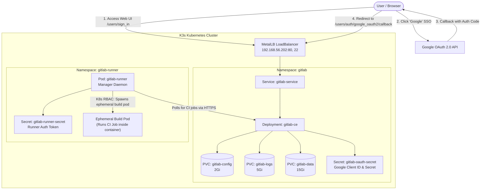

# Manual Deployment: GitLab CE with Google OAuth SSO

This guide provides step-by-step instructions to manually deploy **GitLab Community Edition (CE)** on your local K3s Kubernetes homelab cluster, complete with **Google OAuth Single Sign-On (SSO)** and **automatic account creation on sign up**.

> [!NOTE]
> This deployment is **optional** and isolated in the `gitlab` namespace. It runs alongside your existing workloads without affecting cluster core services (MetalLB, Rancher, KubeVirt).

---

## Architecture Overview



### Key Design Decisions
- **Omnibus Container Deployment**: Deploys the official `gitlab/gitlab-ce` image as a single-pod Deployment backed by K3s `local-path` storage. This is far lighter and more stable for homelab environments than the multi-pod microservices Helm chart (which requires 8-16 GB RAM).
- **Environment-based OmniAuth Secrets**: Google OAuth credentials (`app_id` and `app_secret`) are injected from a Kubernetes `Secret` via `ENV` variables into `GITLAB_OMNIBUS_CONFIG`, keeping secrets out of version control.
- **MetalLB LoadBalancer Integration**: MetalLB automatically assigns an IP from the pool `192.168.56.200-192.168.56.220` to expose HTTP (port 80) and Git SSH (port 22).
- **Kubernetes-native GitLab Runner**: Runs as a lightweight Kubernetes pod in its own `gitlab-runner` namespace. Uses the `kubernetes` executor to dynamically schedule isolated build pods per CI/CD job without needing access to the host Docker daemon or socket.

---

## Prerequisites

1. **Functional K3s Cluster**: With MetalLB deployed and operational.
2. **Google Cloud Account**: Access to [Google Cloud Console](https://console.cloud.google.com/).
3. **Domain Name / Hostname**: A domain (e.g. `gitlab.madhoshyagnik.com`) or local hostname resolving to your MetalLB LoadBalancer IP.

---

## 1. Configure Google Cloud Console for OAuth 2.0

To enable Google sign-in on GitLab, create OAuth 2.0 credentials in Google Cloud Console:

### Step 1.1: Configure OAuth Consent Screen
1. Go to [Google Cloud Console > APIs & Services > OAuth consent screen](https://console.cloud.google.com/apis/credentials/consent).
2. Choose **External** user type and click **Create**.
3. Fill in required fields:
   - **App name**: `GitLab Homelab` (or your preferred name)
   - **User support email**: Your email address
   - **Developer contact information**: Your email address
4. Under **Authorized domains**, add your root domain (e.g. `madhoshyagnik.com`).
5. Click **Save and Continue** through Scopes (default `.../auth/userinfo.email` and `.../auth/userinfo.profile` are sufficient).

### Step 1.2: Create OAuth 2.0 Client ID
1. Navigate to **APIs & Services > Credentials**.
2. Click **+ CREATE CREDENTIALS** > **OAuth client ID**.
3. Set **Application type** to `Web application`.
4. Set **Name** to `GitLab Web Client`.
5. Under **Authorized JavaScript origins**, add:
   ```text
   https://gitlab.madhoshyagnik.com
   ```
6. Under **Authorized redirect URIs**, add the exact GitLab OmniAuth callback URI:
   ```text
   https://gitlab.madhoshyagnik.com/users/auth/google_oauth2/callback
   ```
   > [!IMPORTANT]
   > The callback URI must end exactly in `/users/auth/google_oauth2/callback`. Google OAuth requires `https://` for public domain names.

7. Click **Create**. Save the **Client ID** and **Client Secret**.

---

## 2. Configure Local DNS Resolution

Map the GitLab domain to your MetalLB LoadBalancer IP on your host machine (or your local DNS server / Pi-hole):

1. Check your MetalLB IP allocation pool (default: `192.168.56.200-192.168.56.220`).
2. Add the following entry to `/etc/hosts` on your host machine:
   ```text
   192.168.56.202 gitlab.madhoshyagnik.com
   ```
   *(Replace `192.168.56.202` with the actual IP assigned by MetalLB to `gitlab-service` once deployed).*

### Alternative: Cloudflare Tunnel Routing (Recommended for Public Access)
If exposing GitLab to the internet via Cloudflare Tunnel (`cloudflared`):
1. In the **Cloudflare Zero Trust Dashboard**, navigate to **Networks > Tunnels > Public Hostnames**.
2. Add a public hostname:
   - **Public hostname**: `gitlab.madhoshyagnik.com`
   - **Service Type**: `HTTP`
   - **URL**: `192.168.56.202:80` *(or `http://192.168.56.202:80`)*
3. Cloudflare terminates SSL at the edge and securely proxies HTTP traffic locally to port 80. GitLab handles the rest, generating all canonical links and Google OAuth redirects using `https://gitlab.madhoshyagnik.com`.

---

## 3. Configure Kubernetes Manifests

The deployment manifests are located in [`kubernetes-manifests/gitlab/`](../kubernetes-manifests/gitlab/).

### Step 3.1: Set Your Google OAuth Credentials
Edit [`kubernetes-manifests/gitlab/02-secret.yaml`](../kubernetes-manifests/gitlab/02-secret.yaml) (or create the secret directly with `kubectl`):

```yaml
apiVersion: v1
kind: Secret
metadata:
  name: gitlab-oauth-secret
  namespace: gitlab
type: Opaque
stringData:
  GOOGLE_CLIENT_ID: "YOUR_GOOGLE_CLIENT_ID.apps.googleusercontent.com"
  GOOGLE_CLIENT_SECRET: "YOUR_GOOGLE_CLIENT_SECRET"
  GITLAB_ROOT_PASSWORD: "YourSecureRootPassword123!"
```

Alternatively, create it securely via CLI without editing the file:
```bash
kubectl create namespace gitlab --dry-run=client -o yaml | kubectl apply -f -

kubectl create secret generic gitlab-oauth-secret \
  --namespace gitlab \
  --from-literal=GOOGLE_CLIENT_ID="<YOUR_CLIENT_ID>" \
  --from-literal=GOOGLE_CLIENT_SECRET="<YOUR_CLIENT_SECRET>" \
  --from-literal=GITLAB_ROOT_PASSWORD="<YOUR_ROOT_PASSWORD>" \
  --dry-run=client -o yaml | kubectl apply -f -
```

### Step 3.2: Review Omnibus Configuration
In [`kubernetes-manifests/gitlab/04-deployment.yaml`](../kubernetes-manifests/gitlab/04-deployment.yaml), the container uses `GITLAB_OMNIBUS_CONFIG`:

```ruby
external_url 'https://gitlab.madhoshyagnik.com'

# Web & Reverse Proxy settings
nginx['listen_https'] = false
nginx['listen_port'] = 80
gitlab_rails['gitlab_https'] = true

# Google OAuth SSO configuration
gitlab_rails['omniauth_enabled'] = true
gitlab_rails['omniauth_allow_single_sign_on'] = ['google_oauth2']
gitlab_rails['omniauth_block_auto_created_users'] = false
gitlab_rails['omniauth_providers'] = [
  {
    "name" => "google_oauth2",
    "app_id" => ENV['GOOGLE_CLIENT_ID'],
    "app_secret" => ENV['GOOGLE_CLIENT_SECRET'],
    "args" => { "access_type" => "offline", "approval_prompt" => "" }
  }
]

# Homelab resource tuning
puma['worker_processes'] = 2
sidekiq['concurrency'] = 10
prometheus_monitoring['enable'] = false
```

- `omniauth_allow_single_sign_on = ['google_oauth2']`: Allows users to sign in directly with Google without a pre-existing local account.
- `omniauth_block_auto_created_users = false`: Automatically activates newly registered accounts without administrator intervention.

---

## 4. Deploy GitLab

Apply all manifests with `kubectl`:

```bash
kubectl apply -k kubernetes-manifests/gitlab/
```

### Monitor Deployment Progress
GitLab Omnibus performs initial database migrations, secrets generation, and service startup on its first run (usually takes 3 to 5 minutes):

```bash
# Watch pod initialization
kubectl get pods -n gitlab -w

# Inspect container startup logs
kubectl logs -n gitlab deployment/gitlab -f
```

Wait until the pod reaches `1/1 Running` and readiness probe succeeds:
```text
NAME                      READY   STATUS    RESTARTS   AGE
gitlab-7f98bd46b5-x8q2z   1/1     Running   0          4m
```

---

## 5. Verify Service & Access GitLab

### Check Assigned LoadBalancer IP
```bash
kubectl get svc -n gitlab gitlab-service
```

Example output:
```text
NAME             TYPE           CLUSTER-IP     EXTERNAL-IP      PORT(S)
gitlab-service   LoadBalancer   10.43.120.45   192.168.56.202   80:31234/TCP,22:30122/TCP
```

### Log In with Google
1. Open your browser and navigate to `https://gitlab.madhoshyagnik.com` (or `http://192.168.56.202` if testing via direct IP).
2. On the sign-in page, click the **Google** login button.
3. Sign in with your Google Account and grant permissions.
4. GitLab will authenticate you, automatically create your GitLab profile, and log you in immediately.

### Log In as Root (Administrator)
To access admin features:
- **Username**: `root`
- **Password**: The password defined in `GITLAB_ROOT_PASSWORD`, or retrieved from:
  ```bash
  kubectl exec -it -n gitlab deployment/gitlab -- cat /etc/gitlab/initial_root_password
  ```

---

### 5.1 Bootstrapping Administrator Access (via Pod Exec)

When signing up via Google OAuth 2.0 or local registration, accounts are created with standard (non-admin) permissions. Because a regular user cannot access `/admin` or promote themselves, **administrative access must be bootstrapped from the cluster using `kubectl exec`**.

> [!WARNING]
> **Why `gitlab-rails runner` Hangs on 4GB Homelab Nodes**:
> GitLab Omnibus uses ~3.5 GB of RAM for Puma, Sidekiq, PostgreSQL, Gitaly, and Redis. Running `gitlab-rails runner` boots an entire *second* full Rails runtime requiring an additional ~1.5 GB of RAM. On VMs with 4 GB RAM and no swap, this causes immediate memory exhaustion, CPU thrashing, and freezes the node/kubelet (causing `kubectl exec` to get stuck).
>
> **Always use Method 1 (`gitlab-psql`) below**: It connects directly to the already-running PostgreSQL database, consumes **zero extra memory**, and executes in **under 1 second** without hanging.

---

#### Method 1: Promote Your Existing User via PostgreSQL (Recommended & Instant)
This method connects directly to PostgreSQL inside the GitLab container. It uses virtually zero extra memory (~5 MB) and completes instantly.

1. **List all registered users** (run after you have logged in at least once via Google SSO or web registration):
   ```bash
   kubectl exec -it -n gitlab deployment/gitlab -c gitlab-ce -- \
     gitlab-psql -d gitlabhq_production -c "SELECT id, username, email, admin, state FROM users;"
   ```

2. **Promote your user to Administrator**:
   ```bash
   kubectl exec -it -n gitlab deployment/gitlab -c gitlab-ce -- \
     gitlab-psql -d gitlabhq_production -c "UPDATE users SET admin = true WHERE username = '<your_username>';"
   ```
   *(Or promote by email address: `UPDATE users SET admin = true WHERE email LIKE '%your_email%';`)*.

3. **Verify administrative privileges**:
   ```bash
   kubectl exec -it -n gitlab deployment/gitlab -c gitlab-ce -- \
     gitlab-psql -d gitlabhq_production -c "SELECT id, username, email, admin FROM users WHERE admin = true;"
   ```

4. **Access the Admin Area**:
   Refresh your GitLab web interface at `https://gitlab.madhoshyagnik.com`. The **Admin Area** wrench icon (`/admin`) will immediately appear in your sidebar navigation.

---

#### Method 2: Log in as the Built-in `root` Administrator (Web UI)
Every GitLab deployment includes a default built-in superuser named `root`:

1. **Check your configured root password**:
   The initial root password is set in [`kubernetes-manifests/gitlab/02-secret.yaml`](../kubernetes-manifests/gitlab/02-secret.yaml) via `GITLAB_ROOT_PASSWORD` (default: `Gl_Homelab_2026_xK3s#9`).
2. **Log in**:
   Navigate to `https://gitlab.madhoshyagnik.com/users/sign_in` and sign in using:
   - **Username**: `root`
   - **Password**: `<Your GITLAB_ROOT_PASSWORD>`
3. **Promote other accounts**:
   Once logged in, open **Admin Area (wrench icon) > Overview > Users**, click on your personal account (e.g. Google SSO account), click **Edit**, check **Access level: Administrator**, and click **Save changes**.

---

#### Method 3: Memory-Safe Rails Runner (To Create a Brand-New Admin via CLI)
If you need to create a dedicated standalone admin user purely from the command line without signing in first, you can use `gitlab-rails runner`. On 4 GB nodes, you **must temporarily pause Puma** to free ~1.5 GB of RAM so the command completes smoothly:

```bash
# Step 1: Temporarily pause Puma web server to free up RAM
kubectl exec -it -n gitlab deployment/gitlab -c gitlab-ce -- gitlab-ctl stop puma

# Step 2: Create the standalone administrator user
kubectl exec -it -n gitlab deployment/gitlab -c gitlab-ce -- gitlab-rails runner "
admin = User.new(
  name: 'Homelab Administrator',
  username: 'adminuser',
  email: 'admin@madhoshyagnik.com',
  password: 'YourSecureAdminPassword123!',
  password_confirmation: 'YourSecureAdminPassword123!',
  admin: true
)
admin.skip_confirmation!
admin.save!
puts 'Administrator user created successfully.'
"

# Step 3: Restart Puma web server
kubectl exec -it -n gitlab deployment/gitlab -c gitlab-ce -- gitlab-ctl start puma
```
*(Once created, you can immediately log in with `adminuser` and `YourSecureAdminPassword123!` at `/users/sign_in`).*

---

#### Method 4: Direct Node Execution via `crictl` (Fallback when `kubectl exec` is Stuck)
If the K3s control-plane connection to the worker node or the kubelet SPDY/WebSocket proxy is unresponsive or timing out (e.g. during heavy node CPU or memory contention), bypass Kubernetes API proxying entirely by executing directly on the worker node container runtime:

```bash
# Step 1: SSH directly into the worker node running GitLab
vagrant ssh debian2

# Step 2: Query the active GitLab container ID
CONTAINER_ID=$(sudo k3s crictl ps --name gitlab-ce -q)

# Step 3: Promote user directly using gitlab-psql
sudo k3s crictl exec -it $CONTAINER_ID gitlab-psql -d gitlabhq_production \
  -c "UPDATE users SET admin = true WHERE username = '<your_username>';"

# Step 4: Verify administrator status
sudo k3s crictl exec -it $CONTAINER_ID gitlab-psql -d gitlabhq_production \
  -c "SELECT id, username, email, admin, state FROM users;"
```

---

#### Method 5: Standard Rails Runner or Rake (When Swap Is Enabled on Worker Node)
Once a 4 GB swapfile is configured on the worker node (`debian2` as described below), the kernel has sufficient memory headroom (4 GB RAM + 4 GB swap) to absorb Rails runner execution without freezing or needing to pause Puma:

- **Promote existing user via Rails Runner**:
  ```bash
  kubectl exec -it -n gitlab deployment/gitlab -c gitlab-ce -- gitlab-rails runner \
    "user = User.find_by_any_email('your_email@gmail.com') || User.find_by_username('your_username'); user.admin = true; user.save!; puts \"#{user.username} is now an Administrator!\""
  ```

- **Reset root password via Rake**:
  ```bash
  kubectl exec -it -n gitlab deployment/gitlab -c gitlab-ce -- gitlab-rake "gitlab:password:reset[root]"
  ```

---

#### Homelab Node Tip: Enable Swap on GitLab Worker Node
To prevent worker node lockups during resource spikes (such as background CI/CD tasks, database migrations, or omnibus reconfigurations), add a 4 GB swapfile to the worker node (`debian2`):

```bash
sudo fallocate -l 4G /swapfile
sudo chmod 600 /swapfile
sudo mkswap /swapfile
sudo swapon /swapfile
echo '/swapfile none swap sw 0 0' | sudo tee -a /etc/fstab
```
K3s supports running alongside swap (`--fail-swap-on=false` by default).

---

## 6. Configuring SMTP Email (Outgoing Notifications)

GitLab sends email alerts for pipeline failures, user mentions, password resets, and merge request updates. Outgoing mail can be configured with any standard SMTP provider (Google Workspace / Gmail, SendGrid, Brevo, Mailgun, Amazon SES).

### Step 6.1: Set SMTP Credentials in Secret

SMTP settings are managed in [`kubernetes-manifests/gitlab/02-secret.yaml`](../kubernetes-manifests/gitlab/02-secret.yaml) or created via `kubectl`:

```bash
kubectl create secret generic gitlab-oauth-secret \
  --namespace gitlab \
  --from-literal=GOOGLE_CLIENT_ID="<YOUR_CLIENT_ID>" \
  --from-literal=GOOGLE_CLIENT_SECRET="<YOUR_CLIENT_SECRET>" \
  --from-literal=GITLAB_ROOT_PASSWORD="<YOUR_ROOT_PASSWORD>" \
  --from-literal=SMTP_ENABLED="true" \
  --from-literal=SMTP_ADDRESS="smtp.gmail.com" \
  --from-literal=SMTP_PORT="587" \
  --from-literal=SMTP_USER_NAME="your_email@gmail.com" \
  --from-literal=SMTP_PASSWORD="<YOUR_APP_PASSWORD>" \
  --from-literal=SMTP_DOMAIN="smtp.gmail.com" \
  --from-literal=SMTP_AUTHENTICATION="login" \
  --from-literal=SMTP_FROM_EMAIL="gitlab@madhoshyagnik.com" \
  --from-literal=SMTP_DISPLAY_NAME="GitLab Homelab" \
  --dry-run=client -o yaml | kubectl apply -f -
```

### Step 6.2: Provider Configuration Examples

#### A. Gmail / Google Workspace (Using App Password)
1. Ensure **2-Step Verification** is turned on in your Google Account.
2. Navigate to [Google Account > Security > App Passwords](https://myaccount.google.com/apppasswords).
3. Create an App password with name `GitLab Homelab`. Copy the generated 16-character code (e.g. `abcd efgh ijkl mnop`).
4. Configure parameters:
   - `SMTP_ADDRESS`: `"smtp.gmail.com"`
   - `SMTP_PORT`: `"587"`
   - `SMTP_USER_NAME`: `"your_email@gmail.com"`
   - `SMTP_PASSWORD`: `"abcdefghijklmnop"` (no spaces)
   - `SMTP_DOMAIN`: `"smtp.gmail.com"`
   - `SMTP_AUTHENTICATION`: `"login"`
   - `SMTP_FROM_EMAIL`: `"your_email@gmail.com"` (or your authenticated alias)

#### B. SendGrid
- `SMTP_ADDRESS`: `"smtp.sendgrid.net"`
- `SMTP_PORT`: `"587"`
- `SMTP_USER_NAME`: `"apikey"`
- `SMTP_PASSWORD`: `"<YOUR_SENDGRID_API_KEY>"`
- `SMTP_DOMAIN`: `"madhoshyagnik.com"`
- `SMTP_AUTHENTICATION`: `"plain"`

#### C. Brevo (formerly Sendinblue)
- `SMTP_ADDRESS`: `"smtp-relay.brevo.com"`
- `SMTP_PORT`: `"587"`
- `SMTP_USER_NAME`: `"<YOUR_BREVO_LOGIN_EMAIL>"`
- `SMTP_PASSWORD`: `"<YOUR_BREVO_SMTP_KEY>"`
- `SMTP_DOMAIN`: `"madhoshyagnik.com"`
- `SMTP_AUTHENTICATION`: `"login"`

### Step 6.3: Apply Changes & Reload GitLab

Apply the updated deployment manifest and restart the GitLab pod:
```bash
kubectl apply -k kubernetes-manifests/gitlab/
kubectl rollout restart deployment/gitlab -n gitlab
```

### Step 6.4: Test Email Delivery via CLI

Test that your SMTP connection and credentials are valid by sending a test email directly from Rails:
```bash
kubectl exec -n gitlab deployment/gitlab -c gitlab-ce -- gitlab-rails runner \
  "Notify.test_email('recipient@example.com', 'GitLab SMTP Test', 'Congratulations! Outgoing SMTP email is functioning properly from your K3s GitLab cluster.').deliver_now"
```
*(Ensure swap is active on the node or pause Puma as detailed in Section 5.1 so Rails runner has sufficient headroom).*
If successful, the recipient mailbox will receive the email with the subject `GitLab SMTP Test`.

---

## 7. Deploying GitLab Runner (Kubernetes Executor)

In a typical Docker setup, GitLab Runner runs as a container and relies on the host Docker socket (`/var/run/docker.sock`) to spin up sibling containers. In Kubernetes (K3s), GitLab Runner operates natively as a **Kubernetes Pod** using the **Kubernetes executor**.

> [!IMPORTANT]
> **Instance Runner = One-Time Global Setup (Cluster-Wide)**
> - **Zero Per-Project Setup**: An **Instance Runner** is GitLab's official term for a **Global / Shared Runner**. You configure it **only once** for your entire homelab cluster. Any user, group, or repository on the instance immediately has CI/CD runner access out of the box. Individual projects never need their own runners.
> - **Why Token Generation Is Required Once**: In modern GitLab (v16 & v17+), GitLab deprecated hardcoded static registration tokens for security reasons. An administrator creates the runner record once in the Admin Area so GitLab issues a cryptographic runner authentication token (`glrt-...`). Once deployed, the runner daemon pod stays running in your cluster permanently and executes jobs for all projects.

### How It Works
1. **Runner Manager Pod**: Runs continuously in the `gitlab-runner` namespace, polling the GitLab server over HTTPS (`https://gitlab.madhoshyagnik.com`) for queued jobs.
2. **Ephemeral Build Pods**: When a job arrives, the Runner uses its assigned Kubernetes `ServiceAccount` and RBAC permissions to dynamically schedule a new **Build Pod** in the `gitlab-runner` namespace.
3. **Execution**: The build pod executes the CI/CD job inside the container image specified in `.gitlab-ci.yml` (e.g. `python:3.11`, `node:20`, `alpine:latest`).
4. **Auto-Cleanup**: Once the job finishes, the build pod is immediately deleted by Kubernetes, keeping cluster resource usage strictly on-demand.

---

### Step 7.1: Create an Instance (Global) Runner in GitLab

An **Instance Runner** is managed by administrators and can execute CI/CD jobs across all projects on your GitLab instance.

1. Log in to GitLab as an administrator (`root`).
2. Open the **Admin Area** by clicking the wrench/admin icon in the left sidebar, or go directly to:
   ```text
   https://gitlab.madhoshyagnik.com/admin/runners
   ```
3. Click **New instance runner** (blue button in top-right).
4. Fill in runner details:
   - **Platform**: `Linux`
   - **Tags**: Leave blank or add `k3s, homelab, kubernetes`
   - **Run untagged jobs**: Check this box :white_check_mark: *(Essential so any standard `.gitlab-ci.yml` job without explicit tags runs on this runner)*
   - **Description**: `k3s-homelab-runner`
5. Click **Create runner**.
6. On the next screen, copy the **Runner authentication token** (starts with `glrt-`, e.g. `glrt-t1_abcdef1234567890`).

> [!NOTE]
> GitLab 16+ uses dedicated runner authentication tokens (`glrt-...`) tied to pre-registered runner records instead of legacy shared registration tokens.

---

### Step 7.2: Configure Runner Secret

The runner manifests are located in [`kubernetes-manifests/gitlab-runner/`](../kubernetes-manifests/gitlab-runner/).

Create or update the Kubernetes Secret with your runner token:

```bash
kubectl create namespace gitlab-runner --dry-run=client -o yaml | kubectl apply -f -

kubectl create secret generic gitlab-runner-secret \
  --namespace gitlab-runner \
  --from-literal=CI_SERVER_URL="https://gitlab.madhoshyagnik.com" \
  --from-literal=GITLAB_RUNNER_TOKEN="glrt-YOUR_ACTUAL_RUNNER_TOKEN" \
  --dry-run=client -o yaml | kubectl apply -f -
```

*(Alternatively, edit [`kubernetes-manifests/gitlab-runner/03-secret.yaml`](../kubernetes-manifests/gitlab-runner/03-secret.yaml) directly before applying).*

---

### Step 7.3: Deploy the Runner

Deploy the GitLab Runner daemon and its RBAC role to your cluster:

```bash
kubectl apply -k kubernetes-manifests/gitlab-runner/
```

Verify the Runner pod starts:
```bash
kubectl get pods -n gitlab-runner
```

Inspect runner logs:
```bash
kubectl logs -n gitlab-runner deployment/gitlab-runner -f
```

Expected log output:
```text
Configuration loaded                                builds=0 max_builds=4
Starting multi-runner from /etc/gitlab-runner/config.toml ...
Initializing executor providers                     builds=0 max_builds=4
```

In the GitLab Web UI (**Admin Area > CI/CD > Runners**), the runner will now display a green status dot with status **Online**.

---

### Step 7.4: Test CI/CD Pipeline

To verify end-to-end execution, create a test project or add a `.gitlab-ci.yml` file to an existing repository:

```yaml
stages:
  - test
  - build

test-job:
  stage: test
  image: alpine:latest
  script:
    - echo "Hello from Kubernetes homelab runner!"
    - uname -a
    - cat /etc/os-release

build-job:
  stage: build
  image: node:20-alpine
  script:
    - node --version
    - echo "Build succeeded in an isolated build pod!"
```

Push this file and observe:
1. In GitLab: The pipeline automatically triggers and runs both jobs.
2. In Kubernetes: Run `kubectl get pods -n gitlab-runner -w` to watch the runner spawn dynamic build pods (`runner-...-concurrent-0-...`), run the containerized steps, and cleanly terminate them.

---

## 8. Troubleshooting

### `redirect_uri_mismatch` Error
- **Cause**: The redirect URL sent by GitLab does not match the URL registered in Google Cloud Console.
- **Fix**: Verify that the Authorized Redirect URI in Google Cloud Console matches `external_url` + `/users/auth/google_oauth2/callback` exactly (including protocol `https://` and port if applicable).

### Pod CrashLoopBackOff or Out of Memory (OOMKilled)
- **Cause**: GitLab Omnibus requires at least 2.5 GB of free RAM.
- **Fix**: Check `kubectl describe pod -n gitlab` to see if the worker node ran out of memory. If necessary, adjust `puma['worker_processes'] = 1` or reduce worker thread concurrency in [`04-deployment.yaml`](../kubernetes-manifests/gitlab/04-deployment.yaml).

### Runner Fails with `403 Forbidden` on Job Polling
- **Cause**: The runner authentication token in `gitlab-runner-secret` is either using the placeholder value or has been revoked in GitLab.
- **Fix**: Recreate an Instance Runner in `/admin/runners` and update `gitlab-runner-secret` with the new `glrt-...` token, then restart the deployment (`kubectl rollout restart deployment/gitlab-runner -n gitlab-runner`).

### SSL Certificate Warnings
- If you are terminating SSL at an external proxy or Ingress, ensure the proxy passes `X-Forwarded-Proto: https` so GitLab generates valid HTTPS links.

---

## 9. Cleanup

To remove the optional GitLab and Runner deployments and free up cluster resources:

```bash
# Remove GitLab Runner
kubectl delete -k kubernetes-manifests/gitlab-runner/

# Remove GitLab Server
kubectl delete -k kubernetes-manifests/gitlab/
```

To also delete persistent data volumes (warning: deletes all repositories and databases):
```bash
kubectl delete pvc --all -n gitlab
kubectl delete namespace gitlab
kubectl delete namespace gitlab-runner
```

